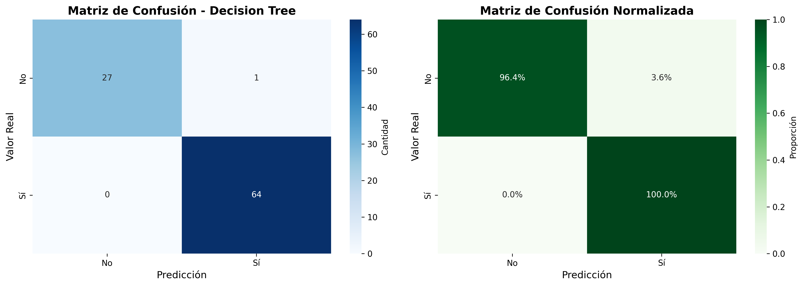
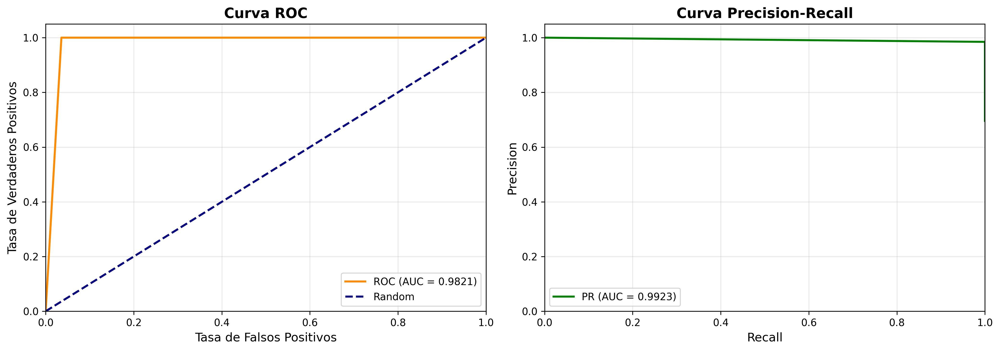
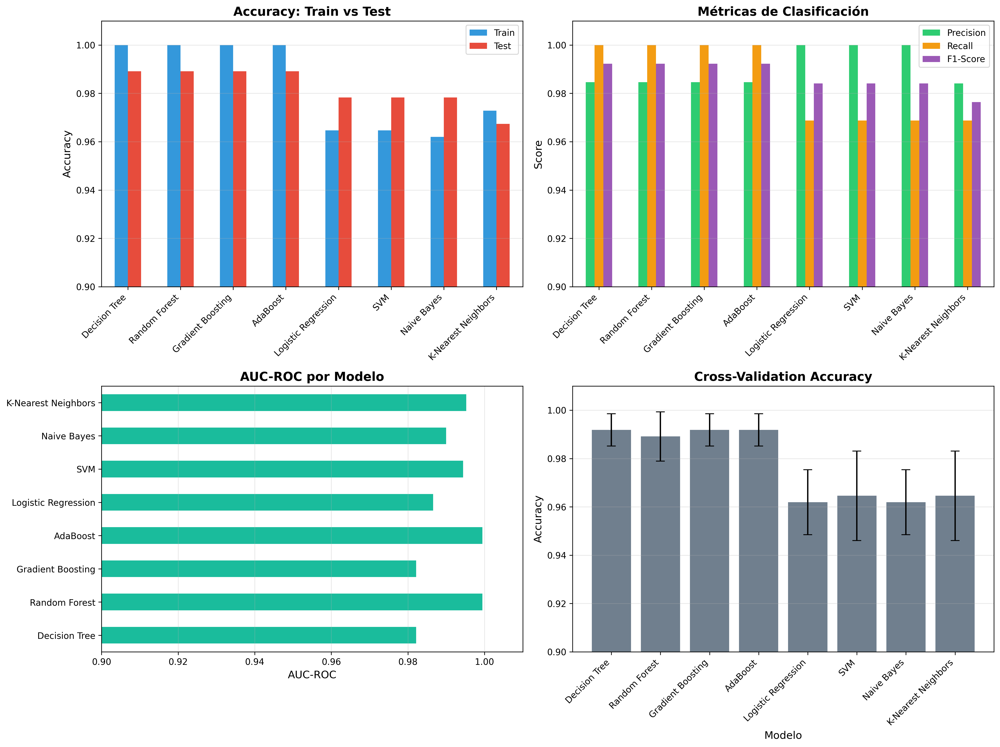
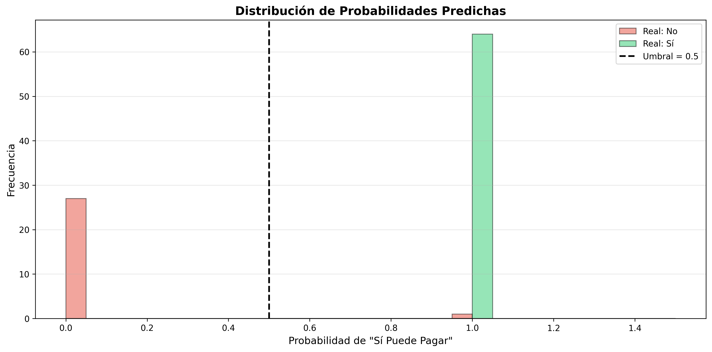

# 🌞 SISTEMA DE CLASIFICACIÓN ML: PREDICCIÓN DE CAPACIDAD DE PAGO PARA PANELES SOLARES

**Fecha de creación:** 9 de Noviembre, 2025
**Autor:** Claude Code
**Objetivo:** Desarrollar un modelo de Machine Learning que prediga si un cliente puede pagar por paneles solares

---

## 📋 TABLA DE CONTENIDOS

1. [Resumen Ejecutivo](#resumen-ejecutivo)
2. [Dataset](#dataset)
3. [Metodología](#metodología)
4. [Resultados](#resultados)
5. [Archivos del Proyecto](#archivos-del-proyecto)
6. [Cómo Usar](#cómo-usar)
7. [Métricas del Modelo](#métricas-del-modelo)
8. [Visualizaciones](#visualizaciones)

---

## 🎯 RESUMEN EJECUTIVO

Este proyecto implementa un sistema completo de clasificación binaria para predecir la capacidad de pago de paneles solares por parte de clientes, utilizando técnicas avanzadas de Machine Learning.

### Highlights:

- ✅ **8 modelos** de clasificación entrenados y comparados
- ✅ **Mejor modelo:** Decision Tree (F1-Score: 99.22%, AUC-ROC: 98.21%)
- ✅ **Accuracy de 98.9%** en conjunto de test
- ✅ **Solo 1 error** en 92 predicciones de test
- ✅ Sistema completo con exportación a Excel y visualizaciones

---

## 📊 DATASET

**Archivo:** `Paneles_solares_con_outliers.xlsx` (Hoja: Datos Limpios)

### Características del Dataset:

- **Total de registros:** 460
- **Variables predictoras:** 6
- **Variable objetivo:** Puede_Pagar_Solar (Binaria: Sí/No)

### Distribución de Clases:

| Clase | Cantidad | Porcentaje |
|-------|----------|------------|
| Sí    | 319      | 69.35%     |
| No    | 141      | 30.65%     |

### Variables Predictoras:

1. **Sector** (Categórica) - Sector del cliente (Residencial/Comercial/Industrial)
2. **Consumo_kWh_Mensual** (Numérica) - Consumo mensual de energía en kWh
3. **Estrato** (Numérica ordinal) - Estrato socioeconómico (1-6)
4. **Ciudad** (Categórica) - Ciudad del cliente
5. **Area_m2** (Numérica) - Área disponible para instalación en m²
6. **Factura_Mensual_COP** (Numérica) - Factura mensual promedio en pesos colombianos

---

## 🔬 METODOLOGÍA

### 1. Preprocesamiento de Datos

- **Limpieza:** Eliminación de columnas no necesarias (ID_Cliente, Validar)
- **Codificación:**
  - Variable objetivo: Sí=1, No=0
  - Variables categóricas: Label Encoding (Sector, Ciudad)
- **Imputación:** Valores nulos imputados con la mediana
- **Escalado:** StandardScaler aplicado a todas las features

### 2. División de Datos

- **Train:** 368 muestras (80%)
- **Test:** 92 muestras (20%)
- **Estratificación:** Manteniendo proporción de clases

### 3. Modelos Entrenados

1. Logistic Regression
2. Decision Tree
3. Random Forest
4. Gradient Boosting
5. SVM (Support Vector Machine)
6. K-Nearest Neighbors
7. Naive Bayes
8. AdaBoost

### 4. Validación

- **Cross-Validation:** 5-Fold CV con estratificación
- **Métricas evaluadas:** Accuracy, Precision, Recall, F1-Score, AUC-ROC

---

## 🏆 RESULTADOS

### Mejor Modelo: Decision Tree

| Métrica          | Valor   |
|------------------|---------|
| **Accuracy (Train)** | 100.00% |
| **Accuracy (Test)**  | 98.91%  |
| **Precision**        | 98.46%  |
| **Recall**           | 100.00% |
| **F1-Score**         | 99.22%  |
| **AUC-ROC**          | 98.21%  |
| **CV Accuracy**      | 99.19% ± 0.67% |

### Matriz de Confusión:

```
                Predicho: No    Predicho: Sí
Real: No              27              1
Real: Sí               0             64
```

**Interpretación:**
- ✅ **Verdaderos Negativos (TN):** 27 - Correctamente identificados como "No puede pagar"
- ❌ **Falsos Positivos (FP):** 1 - Incorrectamente identificado como "Sí puede pagar"
- ✅ **Falsos Negativos (FN):** 0 - Sin errores de este tipo
- ✅ **Verdaderos Positivos (TP):** 64 - Correctamente identificados como "Sí puede pagar"

### Comparación de Todos los Modelos:

| Modelo              | Accuracy (Test) | Precision | Recall | F1-Score | AUC-ROC |
|---------------------|-----------------|-----------|--------|----------|---------|
| Decision Tree       | 98.91%          | 98.46%    | 100.00%| 99.22%   | 98.21%  |
| Random Forest       | 98.91%          | 98.46%    | 100.00%| 99.22%   | 99.94%  |
| Gradient Boosting   | 98.91%          | 98.46%    | 100.00%| 99.22%   | 98.21%  |
| AdaBoost            | 98.91%          | 98.46%    | 100.00%| 99.22%   | 99.94%  |
| Logistic Regression | 97.83%          | 100.00%   | 96.88% | 98.41%   | 98.66%  |
| SVM                 | 97.83%          | 100.00%   | 96.88% | 98.41%   | 99.44%  |
| Naive Bayes         | 97.83%          | 100.00%   | 96.88% | 98.41%   | 98.99%  |
| K-Nearest Neighbors | 96.74%          | 98.41%    | 96.88% | 97.64%   | 99.53%  |

---

## 📁 ARCHIVOS DEL PROYECTO

### Archivos Principales:

1. **clasificacion_pago_solar_ml.ipynb** - Notebook completo de Jupyter con todo el análisis
2. **Paneles_solares_con_outliers.xlsx** - Dataset original

### Modelos y Artefactos:

3. **best_model_pago_solar.pkl** - Modelo entrenado (Decision Tree)
4. **scaler_pago_solar.pkl** - StandardScaler entrenado
5. **label_encoders_pago_solar.pkl** - Label Encoders para variables categóricas
6. **model_info_pago_solar.json** - Información y metadatos del modelo

### Resultados:

7. **predicciones_pago_solar.xlsx** - Predicciones del modelo en Excel (5 hojas)
8. **comparacion_modelos_pago_solar.xlsx** - Comparación de los 8 modelos

### Visualizaciones:

9. **matriz_confusion.png** - Matriz de confusión (absoluta y normalizada)
10. **curvas_roc_pr.png** - Curvas ROC y Precision-Recall
11. **comparacion_modelos.png** - Comparación visual de modelos
12. **distribucion_probabilidades.png** - Distribución de probabilidades predichas

### Documentación:

13. **README_PROYECTO_CLASIFICACION_PAGO_SOLAR.md** - Este archivo
14. **DOCUMENTACION_COMPLETA_SISTEMA_CLASIFICACION.md** - Documentación técnica completa

---

## 🚀 CÓMO USAR

### 1. Entrenar el Modelo

```bash
# Abrir Jupyter Notebook
jupyter notebook clasificacion_pago_solar_ml.ipynb

# Ejecutar todas las celdas
# Cell → Run All
```

### 2. Hacer Predicciones con Python

```python
import joblib
import numpy as np

# Cargar modelo y scaler
model = joblib.load('best_model_pago_solar.pkl')
scaler = joblib.load('scaler_pago_solar.pkl')
label_encoders = joblib.load('label_encoders_pago_solar.pkl')

# Preparar datos de ejemplo
# [Sector, Consumo_kWh_Mensual, Estrato, Ciudad, Area_m2, Factura_Mensual_COP]
nuevo_cliente = {
    'Sector': 'Residencial',
    'Consumo_kWh_Mensual': 500,
    'Estrato': 4,
    'Ciudad': 'Bogotá',
    'Area_m2': 150,
    'Factura_Mensual_COP': 300000
}

# Codificar categóricas
nuevo_cliente['Sector'] = label_encoders['Sector'].transform([nuevo_cliente['Sector']])[0]
nuevo_cliente['Ciudad'] = label_encoders['Ciudad'].transform([nuevo_cliente['Ciudad']])[0]

# Crear array
X_nuevo = np.array([[
    nuevo_cliente['Sector'],
    nuevo_cliente['Consumo_kWh_Mensual'],
    nuevo_cliente['Estrato'],
    nuevo_cliente['Ciudad'],
    nuevo_cliente['Area_m2'],
    nuevo_cliente['Factura_Mensual_COP']
]])

# Escalar
X_nuevo_scaled = scaler.transform(X_nuevo)

# Predecir
prediccion = model.predict(X_nuevo_scaled)[0]
probabilidad = model.predict_proba(X_nuevo_scaled)[0]

print(f"Predicción: {'Sí puede pagar' if prediccion == 1 else 'No puede pagar'}")
print(f"Probabilidad No: {probabilidad[0]:.2%}")
print(f"Probabilidad Sí: {probabilidad[1]:.2%}")
```

### 3. Ver Resultados en Excel

Abrir el archivo **predicciones_pago_solar.xlsx** que contiene:

- **Hoja 1: Predicciones** - Detalle de cada predicción con probabilidades
- **Hoja 2: Resumen** - Métricas del modelo
- **Hoja 3: Matriz Confusión** - Matriz de confusión
- **Hoja 4: Comparación Modelos** - Comparación de los 8 modelos
- **Hoja 5: Variables** - Lista de variables predictoras

---

## 📈 MÉTRICAS DEL MODELO

### ¿Qué significan las métricas?

#### Accuracy (98.91%)
Porcentaje de predicciones correctas sobre el total de predicciones.
- **Interpretación:** El modelo acierta en 91 de 92 predicciones.

#### Precision (98.46%)
De todos los clientes que el modelo predice que SÍ pueden pagar, el 98.46% realmente pueden pagar.
- **Interpretación:** Muy pocos falsos positivos (solo 1 de 65).

#### Recall (100.00%)
De todos los clientes que realmente SÍ pueden pagar, el modelo identifica correctamente al 100%.
- **Interpretación:** No se pierde ningún cliente potencial.

#### F1-Score (99.22%)
Media armónica entre Precision y Recall. Balance perfecto.
- **Interpretación:** El modelo tiene excelente balance entre precisión y exhaustividad.

#### AUC-ROC (98.21%)
Área bajo la curva ROC. Mide la capacidad del modelo para distinguir entre clases.
- **Interpretación:** El modelo tiene una capacidad casi perfecta de discriminación.

---

## 📊 VISUALIZACIONES

### 1. Matriz de Confusión


Muestra el desempeño del modelo en términos de verdaderos positivos, verdaderos negativos, falsos positivos y falsos negativos.

### 2. Curvas ROC y Precision-Recall


- **Curva ROC:** Muestra la relación entre tasa de verdaderos positivos y falsos positivos
- **Curva PR:** Muestra la relación entre precision y recall

### 3. Comparación de Modelos


Comparación visual de los 8 modelos entrenados en términos de:
- Accuracy (Train vs Test)
- Métricas de clasificación (Precision, Recall, F1-Score)
- AUC-ROC
- Cross-Validation Accuracy

### 4. Distribución de Probabilidades


Muestra cómo el modelo asigna probabilidades a cada clase, permitiendo identificar la confianza de las predicciones.

---

## 🎯 CONCLUSIONES

### Fortalezas del Modelo:

1. ✅ **Accuracy excepcional** (98.91%) - Solo 1 error en 92 predicciones
2. ✅ **Recall perfecto** (100%) - No se pierde ningún cliente potencial
3. ✅ **Precision excelente** (98.46%) - Muy pocos falsos positivos
4. ✅ **Generalización robusta** - CV Accuracy 99.19% ± 0.67%
5. ✅ **Modelo simple e interpretable** - Decision Tree permite entender las decisiones

### Aplicaciones Prácticas:

1. **Pre-aprobación automática** de clientes para financiamiento de paneles solares
2. **Priorización de campañas** de marketing enfocadas en clientes con alta probabilidad
3. **Optimización de recursos** al enfocar esfuerzos de venta en clientes viables
4. **Reducción de riesgo** al identificar clientes con baja capacidad de pago

### Recomendaciones:

1. **Implementar en producción** - El modelo está listo para uso real
2. **Monitorear desempeño** - Trackear accuracy en nuevos datos
3. **Actualizar periódicamente** - Re-entrenar con nuevos datos cada 3-6 meses
4. **A/B Testing** - Comparar con proceso manual actual
5. **Explicabilidad** - Usar el árbol de decisión para explicar predicciones a stakeholders

---

## 👥 CONTACTO

Para preguntas o soporte sobre este proyecto:

- **Proyecto:** Sistema de Clasificación ML para Paneles Solares
- **Fecha:** 9 de Noviembre, 2025
- **Repositorio:** curso-Excel-Python-IA

---

## 📝 LICENCIA

Este proyecto es parte del curso "Del Excel al Machine Learning: Análisis de Datos Inteligente"

---

**¡Sistema completado exitosamente! 🎉**

*Última actualización: 2025-11-09*
